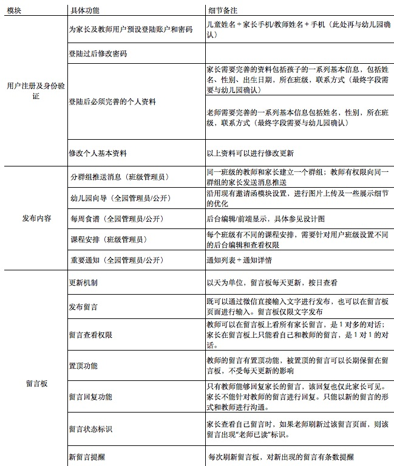
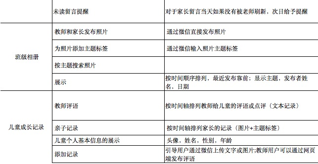

使用帮助

#关于微信幼儿园

微笑是一个基于移动互联网的早期教育产品及服务平台。我们致力于用优秀的技术结合贴近需求的创意，为万千家庭及儿童创造更多愉快而科学的成长体验。
微信幼儿园是我们的核心产品。以微信为入口，我们为中国0-6岁早期教育机构提供完整的移动互联网业务解决方案，开创一种全新的园所文化和家校沟通方式，实现随时随地的家园连接，为儿童和家庭创建一种简单紧密的成长共享氛围。
我们的团队中既有移动互联网领域经验丰富的产品及技术人员，也有早期教育领域深耕多年的一线专家顾问。我们将陆续应用最新的技术，工具，及平台，带给中国0-6岁早期教育市场前所未有、未曾体验过的创新产品及服务。

#功能菜单
   

#使用帮助
1.	如何进行身份认证？
 
第一步：通过扫描本园公众号二维码或是点击“通讯录”-“右上角+号”-“查找公众账”号搜索本园名称，关注本园公众号。

 第二步：在公众账号里点击左下角键盘图标，出现输入框之后，回复手机号码（请确保此手机号码与你提供给幼儿园的手机号码一致）

第三步：根据消息引导，上传你的头像照片（点击右侧“+”号后，再点击“照片”从相册里选择头像添加。家长用户请上传孩子的头像，方便老师辨识。

第四步：点击“认证链接”后，输入预设密码（预设密码由本园老师直接发放给家长）后，完善和确认孩子的个人资料，包括选择孩子生日，父母身份等，点击“完成”即可完成认证。

2.	如何发布留言到留言板

第一步：选择菜单“班级墙”-“发布留言” （点击左下角键盘图标可以随时切换菜单和输入框），会收到消息提示进一步操作。

第二步：点击左下角键盘图标，出现输入框后，在输入框里直接输入你想对老师说的话。发送文字后会收到消息提示进一步操作。

第三步：在输入框里输入数字“1”确认发布。输入“2”取消发布。

第四步：消息上传成功后。根据消息提示中“点击查看”字样，进入留言板可以查看自己的发布留言和本班老师发布的留言。留言仅你和本班老师可见。

3.	如何发布照片到班级相册

第一步：选择菜单“班级墙”-“发布照片”，会收到消息提示进一步操作。

第二步：发布照片前需要为你所发布的照片添加主题。点击左下角键盘图标，输入照片主题文字。输入主题文字后会收到消息提示进一步操作。

第三步：点击右下角“+”号后，点击照片，从相册中选择你要上传的照片。如你想发送多张照片可以从相册进行多选。

第四步：图片上传成功后，根据消息引导，在输入框中回复“1”确认发布。输入“2”取消发布。

第五步：点击消息提示中“点击查看”字样，跳转到班级相册查看你及本班其他家长和教师上传的照片。

4.	如何添加成长记录

第一步：选择菜单“个人中心”-“添加成长记录”，会收到消息提示进一步操作。

第二步：点击左下角键盘图标之后，出现输入框，在输入框中回复“1”发布纯文字记录，回复“2”则是发布照片记录。（教师用户需要根据消息提示先选择本班一名儿童之后，再进行相关操作）

第三步：选择输入之后再根据相关的信息提示，输入文字或是选择照片发布。发布照片需要先添加主题。

第四步：输入文字或上传照片之后，在输入框中输入“1”确认发布。输入“2”取消发布。

第五步：点击消息提示中“点击查看”字样，跳转到儿童成长记录查看教师及家长共同维护的记录主页。


5.	如何修改和管理个人信息

第一步：点击“个人中心”-“修改个人资料”或“修改密码

第二步：点击自动回复的消息提示，进入相关的页面，进入相应的修改操作。

第三步：如需修改个人头像，点击“个人中心”-“修改个人资料”之后，点击左下角键盘图标后，再点击右侧“+”后，点击照片，进入相册进行选择。

6.	如何查看各种相关信息

第一步：点击你想查看的菜单“本园动态”，“班级墙”或是“个人中心”。如果公众号当前出现的是输入框，请点击左侧键盘图标进行切换。

第二步：选择各个菜单里面的子栏目，点击对应的消息引导进行查看即可。

